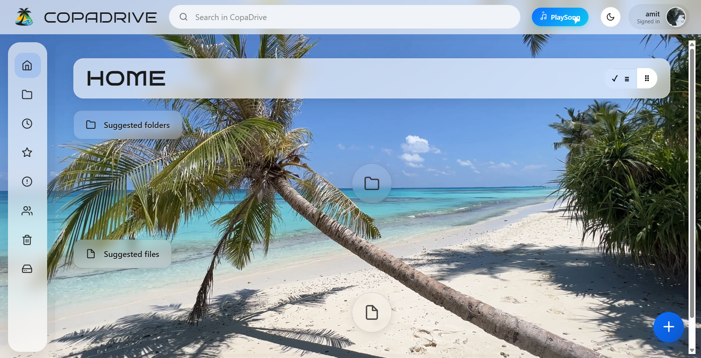
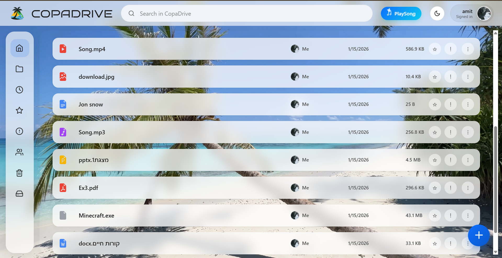
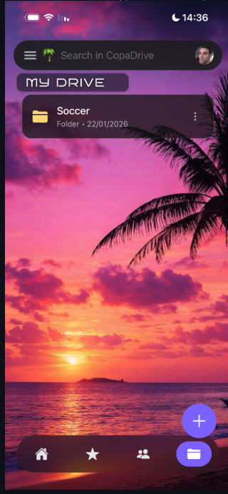
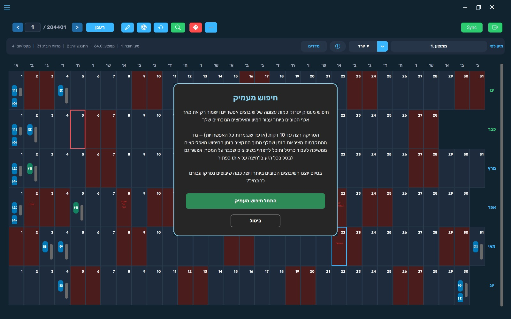

<h1 align="center">Hi 👋, I'm Amit</h1>

<h3 align="center">
Software Engineering Student @ Bar-Ilan University
</h3>

Full-Stack Development • Mobile Development • Algorithms

I enjoy building real-world projects, learning new technologies and turning ideas into working products.

---

## 👨‍💻 About Me

- 🎓 Software Engineering student at Bar-Ilan University
- 💡 Interested in algorithms, software architecture and full-stack development
- ⚛️ Experience developing web applications with React
- 📱 Building mobile applications with React Native and Expo
- 🗄️ Experience working with MongoDB and backend development
- 🤝 Enjoy working on collaborative software projects and team-based development
- 📚 Always learning new technologies and improving my development skills

---

## 🛠️ Technologies & Tools

### Languages

### Web & Mobile

### Databases & Tools

---

# 🚀 Featured Projects

## 🚗 CopaDrive

  
  

  

A collaborative cloud-storage application with web, mobile and backend components, designed for managing, uploading and sharing files through a modern user interface.

**Technologies:**  
JavaScript • React • Node.js • MongoDB • C++ • Kotlin • Git

**Highlights:**
- Web and mobile clients
- File upload and storage management
- User authentication
- File sharing and permissions
- Backend services
- Collaborative team development

🔒 **Private repository — developed as part of a collaborative team project.**

---

## 📅 [Planix](https://github.com/shirbenhamu/Planix)

  
  

A collaborative scheduling and planning system developed as part of a Software Engineering project at Bar-Ilan University.

The system supports schedule generation, constraints, manual editing and advanced search capabilities.

**Technologies:**  
Python • Software Design • Automated Testing • Git • GitHub

**Highlights:**
- Automatic schedule generation
- Advanced search
- Schedule constraints
- Manual schedule editing
- Multiple schedule views
- Testing and documentation
- Team-based iterative development

🔗 [View Repository](https://github.com/shirbenhamu/Planix)

---

## 🔴 [Pokédex](https://github.com/Amit040802/Pokemon-Pokedex)

A Python-based Pokédex application for browsing and displaying Pokémon information through a graphical user interface.

**Technologies:**  
Python • GUI Development • Data Processing

**Highlights:**
- Pokémon data browsing
- Graphical user interface
- Dynamic data presentation
- Application logic and user interaction

🔗 [View Repository](https://github.com/Amit040802/Pokemon-Pokedex)

---

## 🏋️ Fitness Club App

🔒 **Private project — currently in active development**

A mobile fitness management application I'm currently developing with a focus on workout management and a smooth mobile user experience.

**Technologies:**  
React Native • Expo • JavaScript • Backend Development

**Highlights:**
- Mobile-first application
- Workout management
- User-focused interface
- Backend integration
- Ongoing development

---

## 📫 Connect With Me

💼 [LinkedIn](https://www.linkedin.com/in/amit-ben-natan/)  
💻 [GitHub](https://github.com/Amit040802)

---

Thanks for visiting my profile 👋

